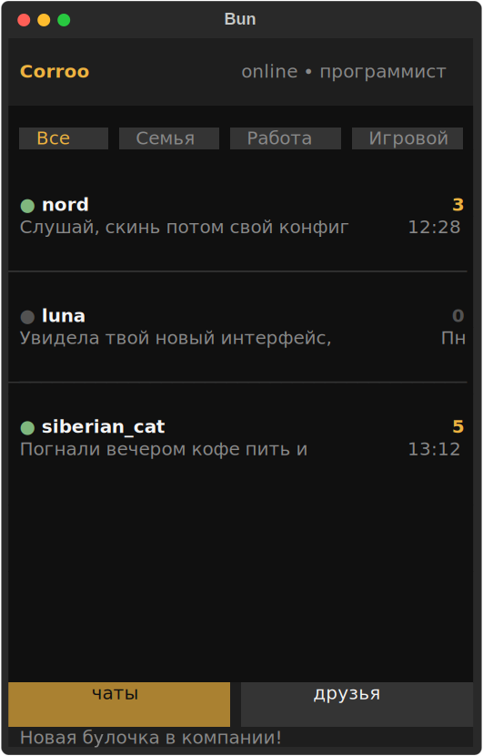

# Bun



Терминальный мессенджер с интерфейсом на `Textual`, ориентированный на приватность, локальную автономность и аккуратный TUI-дизайн.

## Идея проекта

`Bun` задуман как мессенджер, который ощущается иначе по сравнению с типичными desktop и mobile решениями:

- интерфейс работает прямо в терминале
- упор сделан на быстрый, тихий и сфокусированный UX без перегруженного UI
- сообщения и локальное состояние должны оставаться под контролем пользователя
- архитектура ориентирована на `p2p`-взаимодействие и децентрализованный обмен данными

## Ключевые особенности

### Полное шифрование

Целевая модель проекта предполагает сквозное шифрование сообщений:

- сообщение шифруется на стороне отправителя
- расшифровать его может только получатель
- промежуточные узлы и транспорт не должны иметь доступа к открытому содержимому

Это важно для приватности, устойчивости к утечкам и контроля над перепиской.

### Локальное хранение сообщений

Сообщения должны храниться локально у пользователя, а не рассматриваться как “обязательные данные сервера”.

Что это даёт:

- быстрый доступ к истории
- оффлайн-доступ к уже полученным диалогам
- больше контроля над тем, что именно хранится на устройстве
- возможность строить мессенджер без жёсткой привязки к центральной серверной модели

### DHT

`DHT` (`Distributed Hash Table`) нужен как распределённый механизм поиска и маршрутизации данных в децентрализованной сети.

В контексте мессенджера это может использоваться для:

- поиска узлов сети
- обнаружения пользователей или публичных идентификаторов
- хранения и получения служебной информации без одного центрального сервера

Когда это полезно:

- при первом подключении к сети
- при восстановлении связи с пирами
- при поиске того, где сейчас доступен нужный собеседник или маршрут до него

### P2P

`P2P` (`peer-to-peer`) означает прямое взаимодействие между участниками сети без обязательного постоянного центрального посредника.

В мессенджере это нужно для:

- прямой доставки сообщений между пользователями, когда это возможно
- уменьшения зависимости от централизованной инфраструктуры
- повышения устойчивости сети

Когда это полезно:

- при активном общении между двумя пользователями
- при обмене сообщениями внутри небольшой сети
- когда нужен более автономный и распределённый режим работы

## Почему дизайн здесь другой

Главная визуальная особенность проекта в том, что это не веб-интерфейс и не классическое desktop-приложение, а `TUI` на базе `Textual`.

### Что такое Textual

`Textual` — это Python-библиотека для построения полноценных текстовых интерфейсов:

- экраны
- компоненты
- layout-система
- стилизация
- реактивное поведение

### Чем это отличается от других мессенджеров

`Bun` делает ставку не на “ещё один обычный чат”, а на другой формат взаимодействия:

- минималистичный интерфейс без лишнего визуального шума
- высокая скорость работы в терминальной среде
- удобство для разработчиков, power users и тех, кто предпочитает keyboard-first UX
- необычная эстетика: современный интерфейс, но в текстовой оболочке

Именно сочетание `privacy-first`, `local-first`, `p2p`-подхода и `Textual`-интерфейса делает проект отличным от привычных мессенджеров.

## Текущее состояние

На текущем этапе в проекте уже есть:

- TUI-каркас приложения
- экраны `auth`, `chats`, `friends`, `settings`
- отдельный экран диалога
- шапка, табы, navbar, footer, список чатов
- переиспользуемые UI-компоненты для ввода и навигации
- кастомная тема приложения

## Запуск

### 1. Установка зависимостей

```bash
python -m venv venv
source venv/bin/activate
pip install -e .
```

### 2. Запуск приложения

```bash
bun
```

Альтернативно:

```bash
python -m Bun.main
```

## Стек

- Python 3.12+
- Textual
- setuptools

## Дальнейшее развитие

Следующие крупные этапы для проекта:

- полноценный экран переписки
- поиск и работа с друзьями
- логика отправки и получения сообщений
- локальная база хранения
- криптографический слой
- сетевой `p2p`-уровень
- интеграция `DHT` для децентрализованного обнаружения узлов

---

Проект строится как эксперимент на стыке `terminal UI`, приватности и распределённых сетей, компактный по виду.

Всем свежих и горячих булочек !
